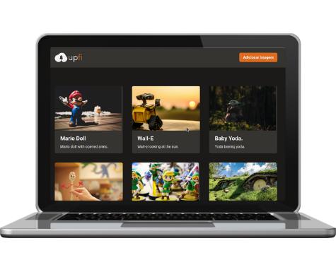
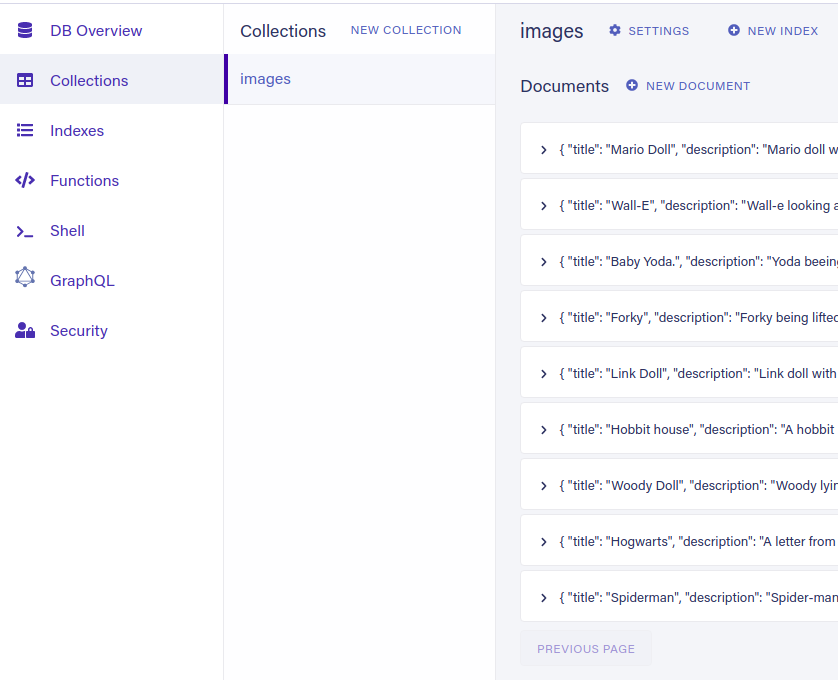

<h1 align="center">
    
</h1>
<br>
<p align="center">
  <a href="#desktop_computer-project"></a>&nbsp;
  <a href="#nail_care-layout"></a>&nbsp;
  <a href="#technologist-technologies"></a>
  <a href="#octocat-environment"></a>&nbsp;
  <a href="#bookmark_tabs-license"></a>&nbsp;
</p>

<p align="center">
 
</p>
<hr>

## :desktop_computer: Project

<strong>Upfi</strong> was created in [@Rocketseat](https://app.rocketseat.com.br/) Ignite's challenges course.

The purpose of creating this page is to deepen and practice knowledge. I was able to learn a lot about:

- Declarative UI,
- React Components,
- React Props,
- React Hooks,
- FaunaDB,
- React Query,
- ImgBB,
- React Hook Form,
- Figma,
- Axios,
- much more...

>`Alert 1:` Due to some features in the styling, it is not recommended to use IE 8 and under. <br>

## :nail_care: Layout
<p align="center">


<h4 align="center">You can also check layout made by<a href="https://app.rocketseat.com.br/"> @Rocketseat</a> at<a href="https://www.figma.com/file/s1mzbCve4Bogvm9OB4xnds/Desafio-2-M%C3%B3dulo-4-ReactJS-(Copy)?node-id=0%3A1"> FIGMA</a>.</h4>

</p>
<br>
<br>
<hr>

## :technologist: Technologies

- [React](https://pt-br.reactjs.org/)
- [Next.js](https://nextjs.org/)
- [Typescript](https://www.typescriptlang.org/)
- [Chakra UI](https://chakra-ui.com/)
- [React Hook Form](https://react-hook-form.com/api/useform/register/)
- [React Query](https://react-query.tanstack.com/guides/infinite-queries)
- [FaunaDB](https://fauna.com/)
- [ImgBB](https://imgbb.com/)

<br>
<hr>

## :octocat: Environment

Keep in mind that the following installations will be needed:

- [Code editor](https://code.visualstudio.com/)
- [Git](https://git-scm.com/book/pt-br/v2/Come%C3%A7ando-Instalando-o-Git)
- [ImgBB account](https://imgbb.com/)
- [FaunaDB account](https://fauna.com/)

Follow the instructions to run the application:

1. Clone the repository: 
```bash 
git remote add origin git@github.com:CaioLemec/img-upload.git
```
2. Open the cloned directorie with your code editor: 
```bash 
code .
```
3. Install all dependencies by using command:
```bash
 yarn
 ```
4. Find and rename the archiv below:
```bash
'.env.exemple' must be '.env.local'
 ```
5. Go to the ImgBB link below, logged in:
```bash
https://api.imgbb.com/
```
6. Generate and copy your API key:
```bash
Go to 'env.local' and put the generated number at the indicated spot.
NEXT_PUBLIC_IMGBB_API_KEY=YOUR GENERATED KEY HERE
```
7. Go to the FaunaDB and create an database:
```bash
You can check how at: 'https://docs.fauna.com/fauna/current/start/index.html'
```
8. At your database, you need create and collection called: `images`



9. Then go to Security and generate & copy your API key:
```bash
Go to 'env.local' and put the generated number at the indicated spot. 
FAUNA_API_KEY=YOUR GENERATED KEY HERE
```
10. Access the generated address in your browser:
```bash
http://localhost:3000/
```
<hr>

## :bookmark_tabs: License

Licensed under MIT [LICENSE](./LICENSE.md).

<hr>

I am available for any clarification. 
    

<h3>Caio Lemec<h3>
<a href="https://t.me/caiolemec">
<a href="mailto:caiolemec@gmail.com">
<a href="https://www.linkedin.com/in/caiolemec/">
<br>
</p>
